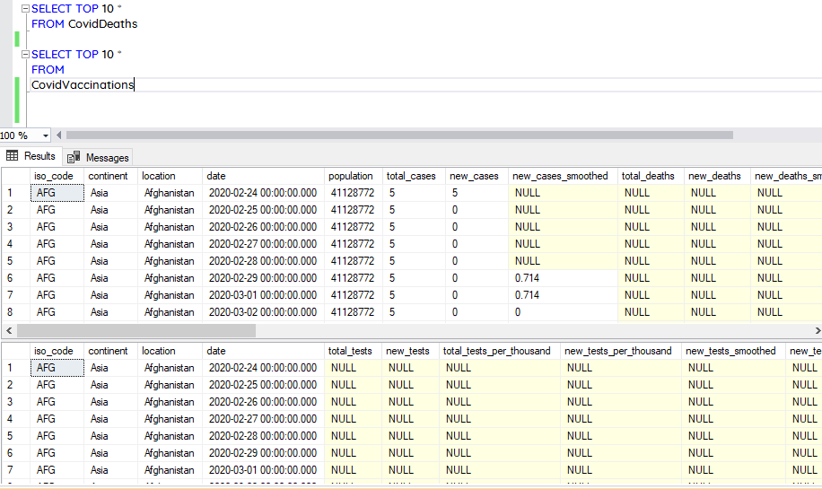
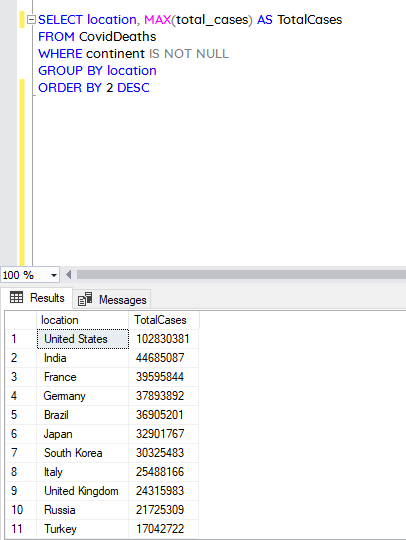
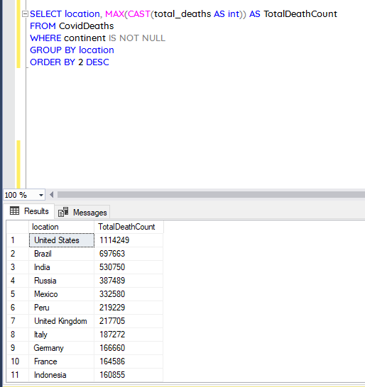
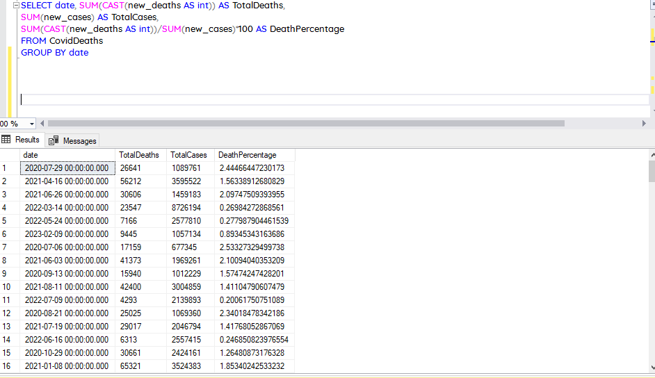
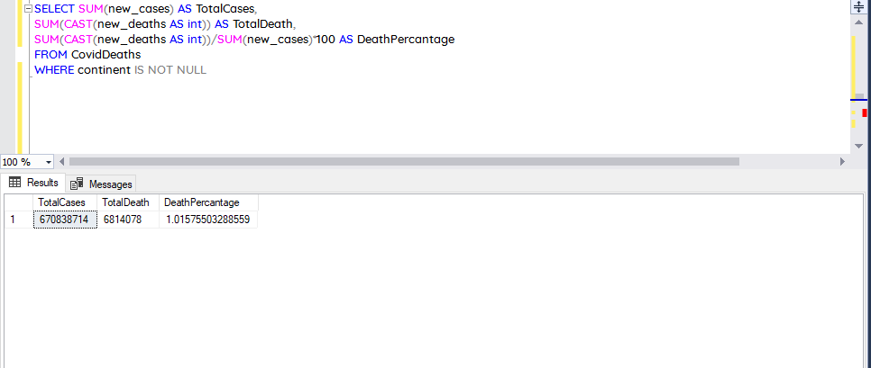
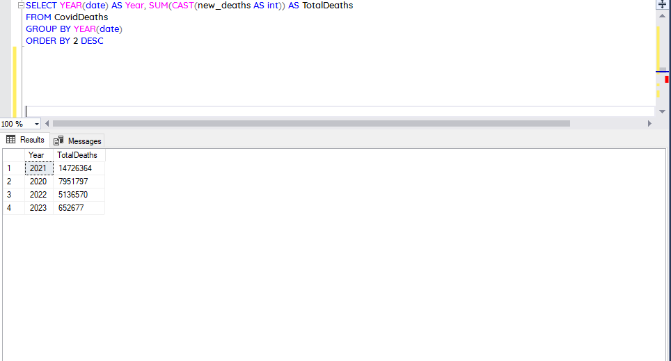
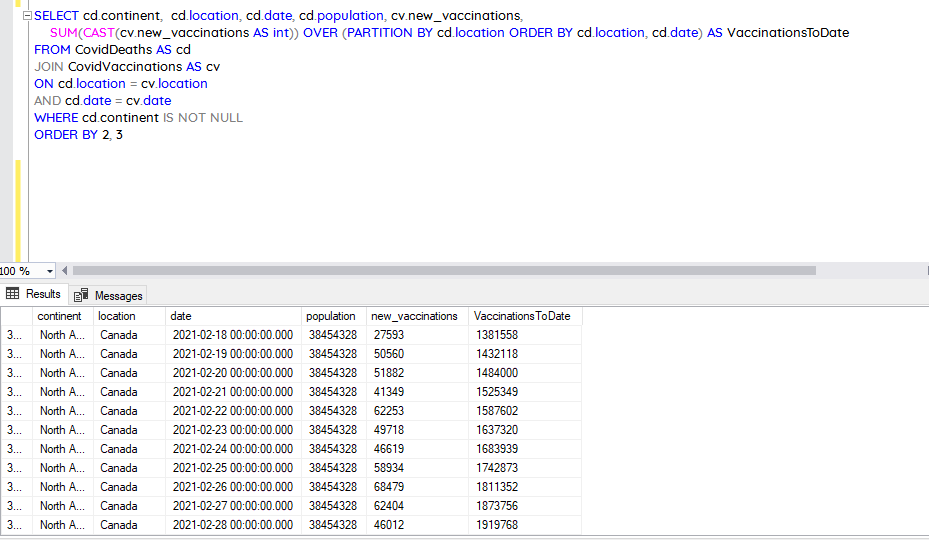

# Covid-Data-Exploration-in-SQL

## Introduction

In this report, I present my findings from conducting data exploration on COVID-19 data using Microsoft SQL Server Management System. As we all know, the COVID-19 pandemic has had a significant impact on the world, affecting nearly every aspect of our lives. Therefore, it is crucial to analyze data related to the pandemic to better understand its impact on society and identify ways to mitigate its effects.

To conduct this analysis, I used SQL queries to extract and transform COVID-19 data into a format suitable for exploration. This involved filtering, aggregating, and joining various tables from the database to create a comprehensive dataset. I then explored this dataset to gain insights into the spread of the virus, the demographics most affected, and the effectiveness of measures taken to control its spread.
## SQL Concepts/Functions applied

- Common Table Expressions (CTE)
- Partitioning, Joins
- CAST()
- SUM()
- MAX()
- YEAR()

## Questions

1.	Which countries have the highest infection and deaths from covid
2.	What is total cases, total deaths and death percentage by date
3.	What is the total global infcetin and death from covid
4.  Which year has the highest death from covid
5.  What is the percentage of the populations vaccinated against covid to date

## Data Processing

The dataset was downloaded from [here](https://ourworldindata.org/covid-deaths). It contains data about covid beginning from 1st January 2020 to 10th February 2023. The dataset was loaded into Microsoft Excel, split into two parts, one part containing data about covid deaths and the other part containing data about vaccinations, with each part having over 200,000 rows of data. The two tables were loaded separately into SSMS. Before beginning the data exploration, I previewed the dataset to ascertain if it was uploaded correctly. The image below represents the code and the output

## Results

1. Countries with highest infection and death count from covid

Infection by Country   | Death by Country
:--------------------: | :-----------------:
 | 

2.	Total cases, death count and death percentage by date

3.	Global infection and death from covid

4. Death by year

5. Total population vaccinated to date

## Conclusions
- United States leads the pack in the infection and death from covid with over 1 million citizens killed by the virus
- Cyprus has the highest percentage infection with over 70% of its populations infected
- Year 2021 witnessed the highest death from covid standing at 14,726,364

